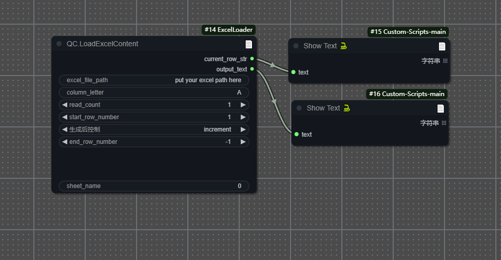

# ComfyUI-QC.ExcelLoader

1.1版本更新
增加了多列同时读取的功能

🚀这是一个可以在ComfyUI中批量读取excel中内容的节点，用于按顺序从指定的 Excel 文件列中读取内容，适用于批量测试。

## 使用说明

将 `QC.LoadExcelContent` 节点添加到你的工作流中，并根据需要配置以下参数：

**输入 (Inputs):**

*   `excel_file_path`: 指向你的 Excel 文件的完整路径。
*   `column_letter`: 你想要读取数据的列的字母标识 (例如: `A`, `B`)。
*   `read_count`: 每次执行节点时，从起始行开始连续读取多少行的内容。
*   `start_row_number`: **首次运行时**从哪一行开始读取 (行号基于 1)。
*   `生成后控制`: 控制读取行的模式（基于`start_row_number`设置的行号）
*   `end_row_number`: 读取操作在哪一行结束（包含此行，基于 1 的索引）。设置为 `-1` 表示一直读取到工作表的最后一行数据。
*   `exclude_text`: 你希望从读取的单元格内容中移除的文本。可以在多行文本框中输入多个需要排除的字符串，每行一个。替换操作是区分大小写的。
*   `sheet_name` (可选): 你想要读取的工作表的名称 (例如 `'Sheet1'`) 或其基于 0 的索引 (例如 `'0'`)。默认为 `'0'`，即读取第一个工作表。

**输出 (Outputs):**

*   `current_row_str`: 本次节点执行时，实际*开始读取*的那一行的行号（以字符串形式输出）。
*   `output_text`: 从 Excel 中读取到的、经过 `exclude_text` 处理后的单元格内容。如果 `read_count` 大于 1，多个单元格的内容会用换行符连接成一个单一的字符串。

**节点示例 (Node):**

