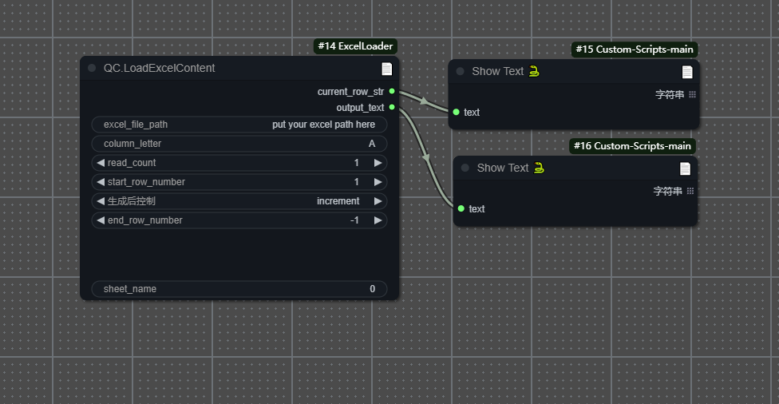

# ComfyUI-QC.ExcelLoader

## 版本更新

**v1.2 - 新增URL图片加载器**
- 新增 `QC.LoadImageFromURL` 节点，可以从URL加载图片
- 支持从Excel读取的URL直接转换为ComfyUI图片格式
- 完美配合Excel节点实现批量图片处理

**v1.1**
- 增加了多列同时读取的功能

🚀这是一个可以在ComfyUI中批量读取excel中内容和URL图片的节点库，包含Excel内容读取和URL图片加载两个功能节点。


## 使用说明

将 `QC.LoadExcelContent` 节点添加到你的工作流中，并根据需要配置以下参数：

**输入 (Inputs):**

*   `excel_file_path`: 指向你的 Excel 文件的完整路径。
*   `column_letter`: 你想要读取数据的列的字母标识 (例如: `A`, `B`)。
*   `read_count`: 每次执行节点时，从起始行开始连续读取多少行的内容。
*   `start_row_number`: **首次运行时**从哪一行开始读取 (行号基于 1)。
*   `生成后控制`: 控制读取行的模式（基于`start_row_number`设置的行号）
*   `end_row_number`: 读取操作在哪一行结束（包含此行，基于 1 的索引）。设置为 `-1` 表示一直读取到工作表的最后一行数据。
*   `exclude_text`: 你希望从读取的单元格内容中移除的文本。可以在多行文本框中输入多个需要排除的字符串，每行一个。替换操作是区分大小写的。
*   `sheet_name` (可选): 你想要读取的工作表的名称 (例如 `'Sheet1'`) 或其基于 0 的索引 (例如 `'0'`)。默认为 `'0'`，即读取第一个工作表。

**输出 (Outputs):**

*   `current_row_str`: 本次节点执行时，实际*开始读取*的那一行的行号（以字符串形式输出）。
*   `output_text`: 从 Excel 中读取到的、经过 `exclude_text` 处理后的单元格内容。如果 `read_count` 大于 1，多个单元格的内容会用换行符连接成一个单一的字符串。


**节点示例 (Node):**


---

## QC.LoadImageFromURL - URL图片加载器

从URL加载图片并转换为ComfyUI标准IMAGE格式，可以完美配合Excel节点使用。

### 主要特性

- ✅ 支持HTTP/HTTPS协议
- ✅ 自动处理EXIF旋转信息
- ✅ 支持透明通道（alpha）
- ✅ 输出ComfyUI标准格式（Tensor，范围0-1）
- ✅ 同时输出图片和遮罩（mask）
- ✅ 支持超时设置

### 使用说明

**输入 (Inputs):**

*   `url`: 图片的URL地址（必须以 http:// 或 https:// 开头）
*   `timeout` (可选): 请求超时时间（秒），默认30秒

**输出 (Outputs):**

*   `image`: ComfyUI标准IMAGE格式的图片张量
    - 格式: `torch.Tensor`
    - 形状: `[1, height, width, 3]`
    - 范围: `0.0 - 1.0`
*   `mask`: 遮罩张量（如果图片有alpha通道则使用，否则为全0表示完全不透明）
    - 格式: `torch.Tensor`
    - 形状: `[1, height, width]`
    - 范围: `0.0 - 1.0`

### 常见使用场景

#### 场景1: 从Excel读取图片URL并加载

这是最典型的使用方式，将两个节点连接起来实现批量图片处理：

1. **准备Excel文件** (例如: `input/images.xlsx`)
   ```
   | A列 (图片URL) |
   |---------------|
   | https://example.com/cat1.jpg |
   | https://example.com/cat2.png |
   | https://example.com/dog1.jpg |
   ```

2. **节点连接**
   ```
   QC.LoadExcelContent → output_text → QC.LoadImageFromURL.url
   QC.LoadImageFromURL → image → [其他图片处理节点]
   ```

3. **配置参数**
   - Excel节点：设置 `column_letter` 为 `A`（URL所在列）
   - Excel节点：设置 `start_row_number` 为 `1`
   - Excel节点：设置 `end_row_number` 为Excel的行数（或-1读到最后）
   - URL节点：将 `timeout` 根据网络情况调整

4. **批量处理**
   - 每次执行工作流，自动读取下一行URL
   - 到达结束行时，工作流自动停止

#### 场景2: 结合Prompt批量生成

同时读取图片URL和对应的提示词：

1. **Excel结构**
   ```
   | A (URL) | B (Prompt) | C (Negative) |
   |---------|-----------|-------------|
   | url1... | a cat, cute | blurry |
   | url2... | a dog, happy | low quality |
   ```

2. **节点设置**
   - 使用第一个Excel节点读取A列（URL）→ 连接到URL图片加载器
   - 使用第二个Excel节点读取B列（Prompt）→ 连接到CLIP Text Encode
   - 使用第三个Excel节点读取C列（Negative）→ 连接到负面提示词
   - 所有Excel节点设置相同的 `start_row_number`，保持同步

#### 场景3: 图生图工作流

将URL加载的图片用于图生图：

```
QC.LoadImageFromURL → image → VAE Encode → KSampler
                     → mask → (可选的遮罩处理)
```

### 支持的图片格式

- ✅ JPEG / JPG
- ✅ PNG (支持透明通道)
- ✅ GIF
- ✅ BMP
- ✅ WebP
- ✅ 其他PIL支持的格式

### 注意事项

⚠️ **网络要求**
- 需要能够访问目标URL
- 建议使用稳定的图床服务
- 对于国外图床，可能需要代理

⚠️ **性能建议**
- 大图片下载可能需要较长时间，适当增加timeout
- 批量处理时建议使用较快的网络连接
- 可以先测试单张图片，确认URL格式正确

⚠️ **错误处理**
- URL格式错误会立即报错
- 网络超时会显示超时错误
- 非图片内容会提示无法识别

---

## 安装依赖

确保安装了所有必需的依赖库：

```bash
pip install -r requirements.txt
```

依赖包括：
- `pandas` - Excel文件读取
- `openpyxl` - Excel格式支持  
- `requests` - HTTP请求（URL下载）
- `Pillow` - 图片处理

## ComfyUI图片格式说明

ComfyUI使用的标准图片格式：
- **类型**: `torch.Tensor`
- **形状**: `[batch_size, height, width, channels]`
- **通道数**: 3 (RGB)
- **数值范围**: 0.0 - 1.0（浮点数）

`QC.LoadImageFromURL` 输出完全符合此标准，可以无缝连接到任何ComfyUI图片节点。

